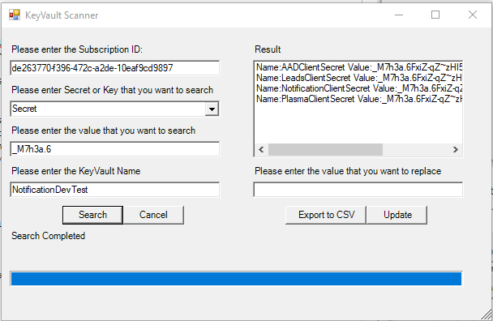

## Introduction
This Utility can search any specified Key/Secret in all KeyVault present in your subscription. The search result than can be exported to an excel file and you can also update the secret directly from the Utility UI.

## How to Use?

- Download the zip and unzip the folder to your local machine.

- Click on Run to launch the application

- Login to Azure from the screen.

- Once logged in enter Subscription ID, Secret/Key, Value to be searched & Keyvault Name and click **Search**

- Utility will start searching secret/key in the KeyVault and Result be displayed in the Result Box as shown

- Result can be Exported to CSV file and file will be saved on Desktop with the name **scanresult.csv**

- You can select what all keys in the result that needs to be updated with new value and pass the value to the textbox and click update
)
## Contributing

This project welcomes contributions and suggestions.  Most contributions require you to agree to a
Contributor License Agreement (CLA) declaring that you have the right to, and actually do, grant us
the rights to use your contribution. For details, visit https://cla.opensource.microsoft.com.

When you submit a pull request, a CLA bot will automatically determine whether you need to provide
a CLA and decorate the PR appropriately (e.g., status check, comment). Simply follow the instructions
provided by the bot. You will only need to do this once across all repos using our CLA.

This project has adopted the [Microsoft Open Source Code of Conduct](https://opensource.microsoft.com/codeofconduct/).
For more information see the [Code of Conduct FAQ](https://opensource.microsoft.com/codeofconduct/faq/) or
contact [opencode@microsoft.com](mailto:opencode@microsoft.com) with any additional questions or comments.

## Trademarks

This project may contain trademarks or logos for projects, products, or services. Authorized use of Microsoft 
trademarks or logos is subject to and must follow 
[Microsoft's Trademark & Brand Guidelines](https://www.microsoft.com/en-us/legal/intellectualproperty/trademarks/usage/general).
Use of Microsoft trademarks or logos in modified versions of this project must not cause confusion or imply Microsoft sponsorship.
Any use of third-party trademarks or logos are subject to those third-party's policies.
